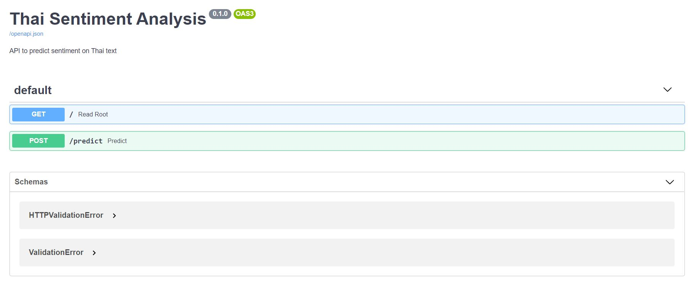
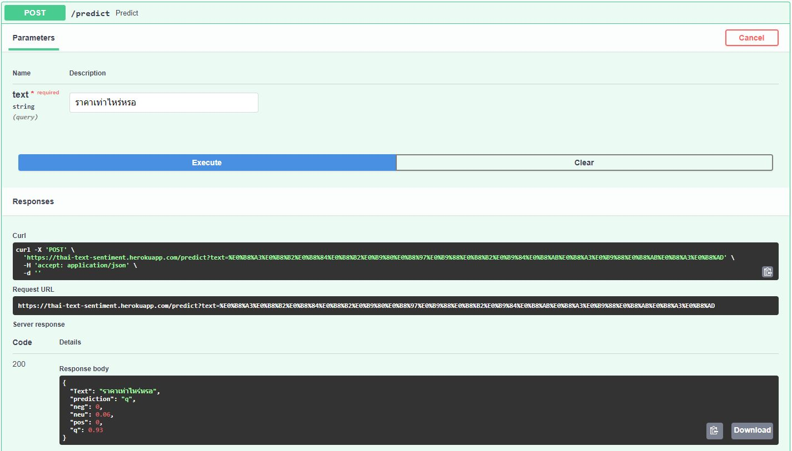
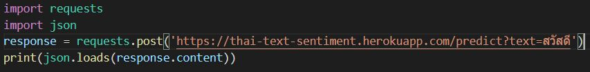
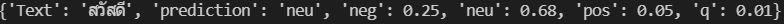

# Thai Text Sentiment Classifier

Using SMOTE + Logistic Regression

This web app is created with [FastAPI](https://fastapi.tiangolo.com/) which is high performance asynchronous library for fast development of APIs.

It automatically generates SwaggerUI for APIs.

## Try it out at https://thai-text-sentiment.herokuapp.com/
## Colab link ->> https://colab.research.google.com/drive/18FmbTYHdEJnUM2q37tDbjx4h_QLp6VN6?usp=sharing

## Screenshots

### SwaggerUI

### Response

### Requests

### Prediction results

